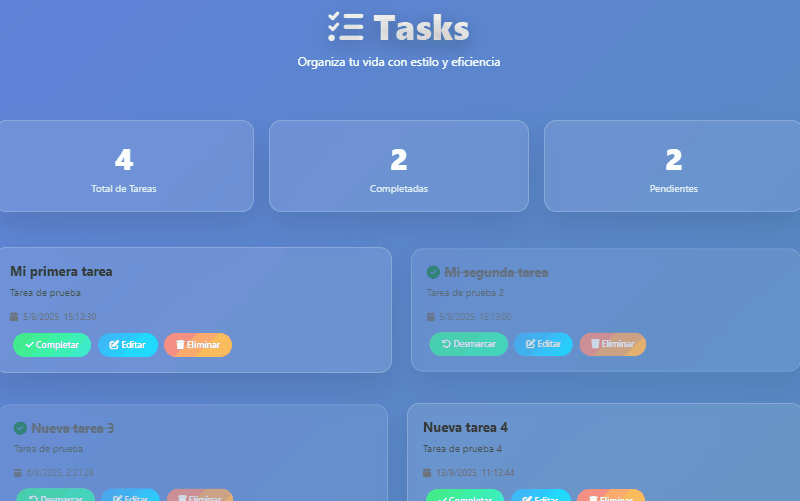

# 🚀 Proyecto Full Stack: Django REST + Next.js

Este proyecto combina un **backend en Django REST Framework** con un **frontend en Next.js y TailwindCSS** para realizar operaciones **CRUD** de forma sencilla y con un diseño minimalista.

---

## 🛠 Tecnologías utilizadas

### Backend

- Python 3
- Django
- Django REST Framework
- django-cors-headers
- SQLite3

### Frontend

- Next.js
- React
- TailwindCSS

---

## 📂 Estructura del proyecto

```Estructura
proyecto-fullstack/
│
├── backend-django/
│   ├── app/ # Modelos, Serializers, Views, Routers
│   ├── manage.py
│   └── requirements.txt
│
├── frontend-next/
│   ├── pages/ # Páginas y Rutas estáticas
│   ├── components/ # Componentes reutilizables
│   ├── package.json
│   └── tailwind.config.js
│
└── README.md
```

---

## ⚙️ Instalación y ejecución

### 1. Clonar repositorio

```bash
git clone https://github.com/tu-usuario/proyecto-fullstack.git
cd proyecto-fullstack
```

### 2. Backend (Django)

```bash
cd backend-django
pip install -r requirements.txt
python manage.py migrate
python manage.py runserver
```

El backend se ejecutará en:
👉 http://localhost:8000

### 3. Frontend (Next.js)

```bash
cd frontend-next
npm install
npm run dev
```

El frontend se ejecutará en:
👉 http://localhost:3000

---

## 📸 Captura de pantalla




- CRUD de items
- Flujo entre frontend y backend

---

## 📌 Próximos pasos

- Añadir autenticación con JWT o tokens.
- Migrar la base de datos de SQLite a PostgreSQL.
- Mejorar la UI con animaciones y componentes dinámicos.
- Desplegar en un servidor (VPS o nube).

---

## 👤 Autor

**Enrique Pérez**  
📅 2025
